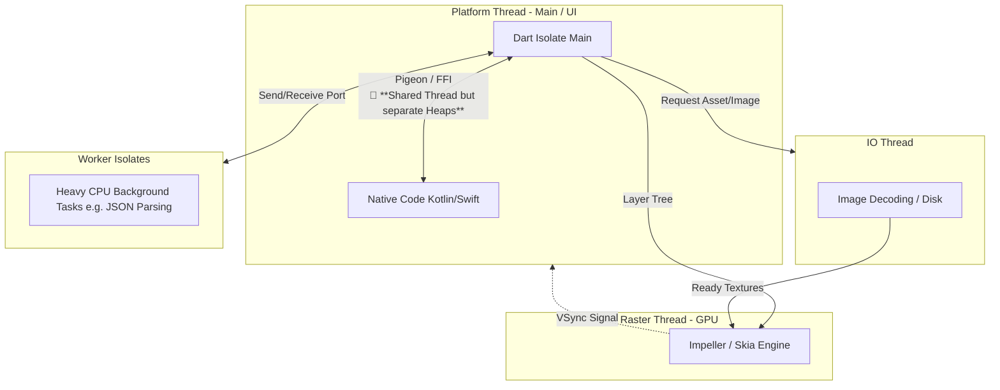

# FFI Playground
A simple Dart playground for calling native code (C ABI) through `dart:ffi`.

## TLDR: The Hello Example
The `native/hello` directory contains two versions of the classic "Hello World" in different languages. It exports the following functions:

- `quick_hello`: Accepts a string and prints a message directly.
- `full_hello`: Accepts a string and returns the message as a new string.
  - **Note:** `free_string` must be called to deallocate the string memory once Dart receives it to prevent memory leaks.

### How to use

1. Compile the `C` and `Rust` libs (see the `Compiling` section below). 
2. Run the `main` function in `bin/ffi_playground.dart`.
```bash
dart run bin/ffi_playground.dart 
```
> Recommended to [Markdown Code Block Runner](https://marketplace.visualstudio.com/items?itemName=renathossain.markdown-runner) extension in Visual Studio Code.

### Compiling

#### C
##### macOS
```bash
clang -dynamiclib -undefined dynamic_lookup native/c/hello.c -o lib/libhello.dylib
```

#### Rust
##### macOS
```bash
cargo build --release --manifest-path native/rust/hello/Cargo.toml --target-dir lib && mv lib/release/libhello_rust.dylib lib/libhello_rust.dylib && rm -rf lib/release
```

#### Go
##### macOS
```bash
go build -buildmode=c-shared -o lib/libhello_go.dylib native/go/hello/hello.go
```

# Dart FFI
* **FFI** stands for `Foreign Function Interface`. `dart:ffi` communicates exclusively using the `C ABI`(**Application Binary Interface**) — the universal standard for binary communication.

* The Analogy: Imagine **Dart speaks Spanish** and **Go speaks German**. They cannot understand each other directly. However, **both languages know how to speak English (C)**.

* The Process: When you use FFI, you force **Dart** to translate its data into **"English"** (`C` pointers like `Pointer<Utf8>`), and you force **Go** to receive and reply in **"English"** (C types like `*C.char`).

* Compatibility: Languages like `C`, `C++`, and `Rust` work seamlessly with FFI, while languages like `Go` require a tiny wrapper (`cgo`) to **"disguise" themselves as C libraries**.

# Background threading in Flutter
## Thread Merge in Flutter 3.39
Historically, the Flutter Engine managed three dedicated threads in addition to the Native Platform Thread. Since recent updates (Flutter 3.x+), the `UI Thread` has been unified with the `Platform Thread`.

### Pre-Merge Architecture:
1. Platform Thread: Host OS main thread (Android/iOS). Handles native events and lifecycle.
2. UI Thread: Dart Isolate execution and Framework logic.
> Note: The `main Isolate` **resided on this UI Thread**, a dedicated execution context managed internally by the Flutter Engine.
3. Raster Thread: Rendering instructions (GPU).
4. IO Thread: Expensive background tasks like image decoding and asset loading.

### Post-Merge (Flutter 3.39+ / Impeller):
With the `UI Thread` merged into the `Platform Thread`, the Android/iOS `main thread` now **handles dual responsibilities**:
1) Processing native system events.
2) **Running the main Isolate’s logic within the same host thread**. 

> 🚨 CRITICAL: While they share the same Thread, **they do not share the same Memory (Heap)**. Data must still be **serialized or converted** when crossing this "bridge" (via Pigeon), or managed via pointers (via FFI), although communication is now synchronous and has zero thread-switching latency.



|Feature|Pre-Merge|Post-Merge (Flutter 3.39+)|
|-|-|-|
|Main Isolate Location|Dedicated UI Thread|Shared Platform Thread|
|Communication|Asynchronous (Thread hop)|**Synchronous (Same thread)**|
|Event Loop|Separate loops|Single Unified Event Loop|
|Memory (Heap)|Separate|Still Separate! (Isolated)|
|FFI Performance|Fast (but with thread switch)|Instant (Zero context switch)|

### Unified Event Loop
The Unified Event Loop means that Dart's execution is now interleaved with native OS tasks on the platform's primary message loop. By removing the need for expensive context switching and synchronization between two separate threads, Flutter achieves a more efficient and responsive execution model for both Dart and Native interactions.

### Pigeon: From "Thread Bridge" to "Language Bridge"

In Flutter 3.39+, the role of `Pigeon` has shifted from managing concurrency to **focusing purely on interoperability**.

* Pre-Merge (Asynchronous): Two threads, two "owners of time." Communication was a message sent between offices. You had to await for the other worker to finish.

* Post-Merge (Synchronous): One thread, one "owner of time." Communication is a direct call. The thread simply pauses Dart, executes Native code, and returns with the result.

#### Technical Reality:
What used to be Cross-Thread Communication is now just **Cross-Language Execution**. Since it's the same thread, the "wait" is gone; it is now a sequential function call.

* **Old way**: Send a letter, wait for a reply (await).
* **New way**: Turn around and ask the person next to you (Direct call).

### Notes

> Use FFI for high-performance communication with C/C++/Rust via pointers; use Pigeon for safe, high-level communication with Android/iOS APIs (Kotlin/Swift) via serialization.

